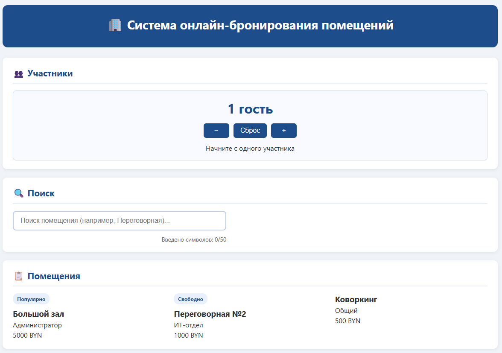
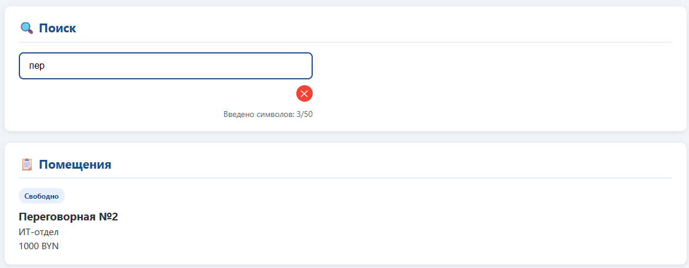
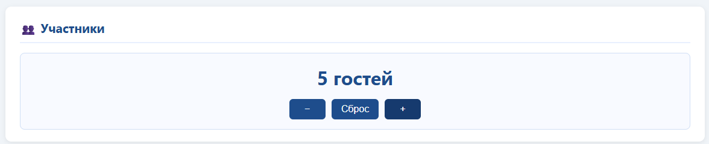

# 🏢 Система онлайн-бронирования помещений

> Практическая работа №10: Введение в React.js — Компоненты, JSX, Props, State

## **Тема курсового проекта:** «Система онлайн-бронирования помещений»

## 📋 Содержание

- [🎤 Вопросы интервью](#-interview-corner)
- [🧩 Декомпозиция проекта](#-декомпозиция-проекта)
- [🖼 Скриншоты](#-скриншоты)
- [🛠 Технологии](#-технологии)
- [🚀 Запуск проекта](#-запуск-проекта)
- [🔗 Связь с курсовым проектом](#-связь-с-курсовым-проектом)

---

## 🎤 Interview Corner

### 1. Чем компонент отличается от обычной JS-функции?

> Компонент в React — это функция, которая **возвращает JSX** (описание интерфейса) и участвует в **жизненном цикле React**. В отличие от обычной функции, компонент:
>
> - Может хранить внутреннее состояние через `useState`
> - Получает данные от родителя через `props`
> - Автоматически перерисовывается при изменении state или props
> - Следует правилам именования (с заглавной буквы) и возвращает один корневой элемент
>
> **Пример:**
>
> ```js
> // Обычная функция
> function sum(a, b) {
>   return a + b;
> }
>
> // Компонент React
> function Welcome({ name }) {
>   return <h1>Привет, {name}!</h1>; // Возвращает JSX
> }
> ```

### 2. Что такое props? Можно ли их изменять внутри компонента?

> **Props** (properties) — это входные данные, которые родительский компонент передаёт дочернему. Это механизм **однонаправленного потока данных** (data flows down).
>
> **Изменять props внутри компонента НЕЛЬЗЯ**, потому что:
>
> - Props принадлежат родителю — это его данные
> - Прямое изменение нарушит предсказуемость приложения
> - Реактивность React основана на неизменяемости входных данных
>
> **Правильный подход:** если нужно изменить данные, дочерний компонент сообщает об этом родителю через функцию-коллбек, переданную в props.
>
> ```js
> // ❌ Нельзя:
> props.userName = "Новое имя";
>
> // ✅ Можно:
> function Child({ onNameChange }) {
>   return <button onClick={() => onNameChange("Новое имя")}>Изменить</button>;
> }
> ```

### 3. Что такое state? Почему нельзя писать `count = count + 1`?

> **State** — это внутреннее состояние компонента, которое хранится внутри и может изменяться со временем. При изменении state React **автоматически перерисовывает** компонент.
>
> **Нельзя писать `count = count + 1`**, потому что:
>
> - React не отслеживает прямые присваивания переменных
> - Компонент не узнает, что данные изменились → не будет ре-рендера
> - Это нарушает принцип реактивности: UI = f(state)
>
> **Правильно:** использовать setter-функцию, возвращаемую `useState`:
>
> ```js
> const [count, setCount] = useState(0);
>
> // ✅ Правильно:
> setCount(count + 1);
> // ✅ Ещё лучше (функциональное обновление):
> setCount((prev) => prev + 1);
> ```

### 4. Чем JSX отличается от HTML? Назовите 3 отличия.

| Особенность        | HTML                          | JSX (React)                           |
| ------------------ | ----------------------------- | ------------------------------------- |
| **Класс элемента** | `<div class="box">`           | `<div className="box">`               |
| **События**        | `<button onclick="handle()">` | `<button onClick={handle}>`           |
| **Стили (inline)** | `<div style="color: red">`    | `<div style={{ color: 'red' }}>`      |
| **Закрытие тегов** | ``             | ``                   |
| **Вставка JS**     | Только через `<script>`       | В фигурных скобках: `<h1>{name}</h1>` |
| **Атрибут `for`**  | `<label for="id">`            | `<label htmlFor="id">`                |

**Три ключевых отличия:**

1. `className` вместо `class` (т.к. `class` — зарезервированное слово в JS)
2. События в camelCase: `onClick`, `onChange`, `onSubmit`
3. Все теги должны быть закрыты, включая одиночные: `<input />`, `<br />`

### 5. Что такое управляемый компонент и почему он важен для форм?

> **Управляемый компонент** (controlled component) — это элемент формы, значение которого полностью контролируется через React state.
>
> **Как это работает:**
>
> 1. Значение инпута хранится в state: `const [value, setValue] = useState('')`
> 2. Инпут получает `value={value}` и `onChange={(e) => setValue(e.target.value)}`
> 3. При каждом вводе state обновляется → компонент перерисовывается → инпут показывает новое значение
>
> **Почему это важно:**
>
> - ✅ Единый источник правды: значение всегда в state, а не в DOM
> - ✅ Можно программно изменять/очищать поле
> - ✅ Легко валидировать ввод в реальном времени
> - ✅ Упрощает тестирование и отладку
>
> ```js
> function SearchForm() {
>   const [query, setQuery] = useState("");
>   return (
>     <input
>       value={query}
>       onChange={(e) => setQuery(e.target.value)}
>       placeholder="Поиск..."
>     />
>   );
> }
> ```

### 6. Как Вы понимаете формулу `UI = f(state)`?

> Эта формула — **фундаментальный принцип React**:
>
> ```
> Интерфейс (UI) = функция (f) от состояния данных (state)
> ```
>
> **Что это значит на практике:**
>
> - Вы описываете, **как должен выглядеть интерфейс** при определённом состоянии
> - Вы **меняете только данные** (state), а React сам обновляет UI
> - Нет необходимости вручную искать элементы в DOM и менять их
>
> **Пример:**
>
> ```js
> function Counter() {
>   const [count, setCount] = useState(0);
>   // UI автоматически перерисуется, когда count изменится
>   return (
>     <div>
>       <p>Счёт: {count}</p>
>       <button onClick={() => setCount(count + 1)}>+1</button>
>     </div>
>   );
> }
> ```
>
> **Преимущества:**
>
> - 🎯 Предсказуемость: одинаковый state → одинаковый UI
> - 🔄 Автоматическая синхронизация: не нужно вручную обновлять DOM
> - 🧪 Тестируемость: можно проверить UI, просто передав разные state

### 7. Зачем компонентам в React нужен `key` при рендеринге списка через `map()`?

> **`key`** — это специальный строковый атрибут, который помогает React **идентифицировать элементы списка** при обновлении.
>
> **Зачем это нужно:**
>
> - 🔍 **Эффективное обновление**: React сравнивает ключи, чтобы понять, какие элементы добавлены, удалены или изменены
> - ⚡ **Производительность**: перерисовываются только изменившиеся элементы, а не весь список
> - 🧠 **Сохранение состояния**: если у элементов есть локальный state, key помогает React сохранить его при перестановке
>
> **Правила использования:**
>
> ```js
> // ✅ Правильно: уникальный стабильный id
> {
>   services.map((service) => <ServiceCard key={service.id} {...service} />);
> }
>
> // ❌ Не рекомендуется: индекс массива (ломается при сортировке/фильтрации)
> {
>   services.map((service, index) => (
>     <ServiceCard key={index} {...service} /> // ⚠️ Проблемы при изменении порядка
>   ));
> }
> ```
>
> **Важно:** `key` должен быть **уникальным среди соседей** и **стабильным** (не меняться при перерисовке).

---

## 🧩 Декомпозиция проекта

### Текущая структура (практическая работа)

```
src/
├── components/
│   ├── ServiceCard.jsx    # Карточка помещения (props: name, price, address, badge)
│   ├── GuestSelector.jsx  # Выбор количества гостей (useState: +/-, reset)
│   ├── ServiceSearch.jsx  # Поиск по названию (controlled input)
│   ├── TimeSlot.jsx       # Заглушка для выбора времени
│   └── BookingForm.jsx    # Заглушка формы бронирования
│
├── App.js                 # Корневой компонент: данные, фильтрация, сборка
├── App.css                # Стили приложения
├── index.js               # Точка входа (ReactDOM.createRoot)
└── index.css              # Глобальные стили
```

### Планируемая структура (курсовой проект)

```
src/
├── components/
│   ├── layout/
│   │   ├── Header.jsx         # Шапка с навигацией
│   │   └── Footer.jsx         # Подвал с контактами
│   │
│   ├── rooms/
│   │   ├── RoomCard.jsx       # Карточка помещения (расширенная)
│   │   ├── RoomList.jsx       # Список с фильтрацией и пагинацией
│   │   └── RoomFilters.jsx    # Фильтры: тип, вместимость, оборудование
│   │
│   ├── booking/
│   │   ├── DatePicker.jsx     # Выбор даты (календарь)
│   │   ├── TimeSlotPicker.jsx # Выбор временного слота
│   │   ├── BookingForm.jsx    # Многошаговая форма бронирования
│   │   └── BookingSummary.jsx # Итог бронирования перед подтверждением
│   │
│   ├── user/
│   │   ├── BookingList.jsx    # Список моих бронирований (localStorage)
│   │   └── UserProfile.jsx    # Профиль пользователя
│   │
│   └── ui/
│       ├── Button.jsx         # Переиспользуемая кнопка
│       ├── Modal.jsx          # Модальное окно
│       └── Badge.jsx          # Статус-бейдж
│
├── hooks/
│   ├── useLocalStorage.js     # Хук для работы с localStorage
│   └── useBookingValidation.js # Валидация формы бронирования
│
├── utils/
│   ├── dateHelpers.js         # Форматирование дат/времени
│   └── api.js                 # Запросы к API (будущее)
│
├── data/
│   ├── mockRooms.js           # Мок-данные для разработки
│   └── initialBookings.js     # Начальные бронирования
│
├── App.js                     # Роутинг, глобальное состояние
├── index.js                   # Точка входа
└── styles/
    ├── variables.css          # CSS-переменные
    └── globals.css            # Глобальные стили
```

### Принцип декомпозиции

> Каждый компонент отвечает **за одну задачу**:
>
> - `RoomCard` — только отображение данных помещения
> - `DatePicker` — только выбор и валидация даты
> - `BookingForm` — только сбор и отправка данных формы
>
> Данные текут **сверху вниз**: `App → RoomList → RoomCard`  
> События текут **снизу вверх**: `RoomCard → onBook → App`

---

## 🖼 Скриншоты

### 📸 Статичный вид: каталог помещений



> _Отображение карточек помещений с данными, переданными через props_

### 📸 Список через `.map()` + фильтрация



> _Поиск по названию помещения: список обновляется в реальном времени_

### 📸 Интерактив: GuestSelector + управляемый input



> _Работа useState: изменение количества гостей, ввод в поле поиска_

> 💡 _Примечание: скриншоты добавлены в папку `/screenshots` репозитория_

---

## 🛠 Технологии

```json
{
  "react": "^19.2.3",
  "react-dom": "^19.2.3",
  "create-react-app": "^5.0.1",
  "eslint": "^8.57.0",
  "web-vitals": "^4.2.4"
}
```

### Инструменты разработки

- ⚛️ **React 19** — библиотека для построения интерфейсов
- 📦 **Create React App** — сборка проекта без конфигурации
- 🎨 **CSS Modules** — изоляция стилей компонентов
- 🔍 **ESLint** — линтинг кода по правилам React
- 🧪 **React Developer Tools** — отладка компонентов

---

## 🚀 Запуск проекта

```bash
# 1. Клонировать репозиторий
git clone https://github.com/igorao2802-dev/react-start-practice
cd react-start-practice

# 2. Установить зависимости
npm install

# 3. Запустить в режиме разработки
npm start

# 4. Открыть в браузере
# → http://localhost:3000
```

### Доступные скрипты

| Команда         | Описание                                            |
| --------------- | --------------------------------------------------- |
| `npm start`     | Запуск в режиме разработки (с авто-обновлением)     |
| `npm run build` | Сборка оптимизированной версии для продакшена       |
| `npm test`      | Запуск тестов (Jest)                                |
| `npm run eject` | Выход из CRA (необратимо, только при необходимости) |

### Структура после запуска

```
react-start-practice/
├── node_modules/      # Зависимости (не коммитится)
├── public/            # Статические файлы
│   ├── index.html     # HTML-шаблон
│   └── manifest.json  # PWA-манифест
├── src/               # Исходный код
│   ├── components/    # Компоненты
│   ├── App.js         # Корневой компонент
│   └── index.js       # Точка входа
├── package.json       # Зависимости и скрипты
└── README.md          # Этот файл
```

---

## 🔗 Связь с курсовым проектом

### 🎯 Тема курсового проекта

> **«Система онлайн-бронирования помещений»** — SPA для резервирования конференц-залов, переговорных и коворкинг-зон в реальном времени.

### 📋 Функционал (планируемый)

```
✅ Регистрация / авторизация пользователя
✅ Каталог помещений с фильтрами (тип, вместимость, оборудование)
✅ Календарь с доступными датами
✅ Выбор временного слота из доступных
✅ Многошаговая форма бронирования с валидацией
✅ Список моих бронирований (localStorage → API)
✅ Статусы: «Подтверждено», «Ожидает», «Отменено»
```

### 🔄 Как практическая работа помогает курсовому проекту

| Навык из практики      | Применение в курсовом проекте                               |
| ---------------------- | ----------------------------------------------------------- |
| **Компоненты + props** | `RoomCard` получает данные о помещении от `RoomList`        |
| **useState + setter**  | Управление состоянием формы бронирования, выбор даты        |
| **Управляемые инпуты** | Валидация полей формы в реальном времени                    |
| **Условный рендеринг** | Показ/скрытие слотов времени, сообщений об ошибках          |
| **Рендеринг списков**  | Отображение каталога помещений через `.map()`               |
| **Декомпозиция**       | Разделение интерфейса на независимые переиспользуемые блоки |

### 🗺 Дорожная карта развития проекта

```
Этап 1 (практика) ✅
├─ ServiceCard с props
├─ GuestSelector с useState
└─ ServiceSearch с фильтрацией

Этап 2 (курсовой проект, часть 1) 🔄
├─ Интеграция с localStorage для сохранения бронирований
├─ Валидация формы через zod/react-hook-form
├─ Выбор даты и времени через кастомные компоненты

Этап 3 (курсовой проект, часть 2) ⏳
├─ Подключение backend API (Node.js + Express)
├─ Авторизация через JWT
├─ Real-time обновления через WebSocket
```

---
